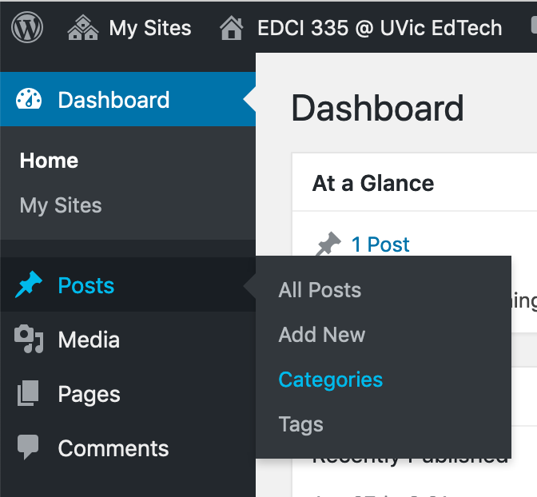

Using a blog for course communications has some distinct advantages over a typical course in an LMS (Learning Management System, like Moodle). One advantage is that you are in control over your work and you won't necessarily lose access to your work after you complete the course or leave UVic. Another is that blogging on a public site allows for a wider audience for your work, rather than a single instructor.

There are some things that you *MUST* to do to make this model of course work properly, and some things that will make it a richer experience for everybody.

### Categories

One of the first things you should do on your new blog is to create a course category.

##### On your Dashboard, tap 'Posts', then choose 'Categories'.

##### On the 'Categories' page, add a new category 'edci335'.
- no spaces
- lowercase
- leave the 'slug' blank
- exactly as you see it below*

!! \*If you are in a different course, like EDCI 339, then use that course number.

##### Tap 'Add New Category'.

!!! Every time you publish a post for this course, you **MUST** use the category for this course. If you are taking EDCI335, then use the category 'edci335' on every post.
